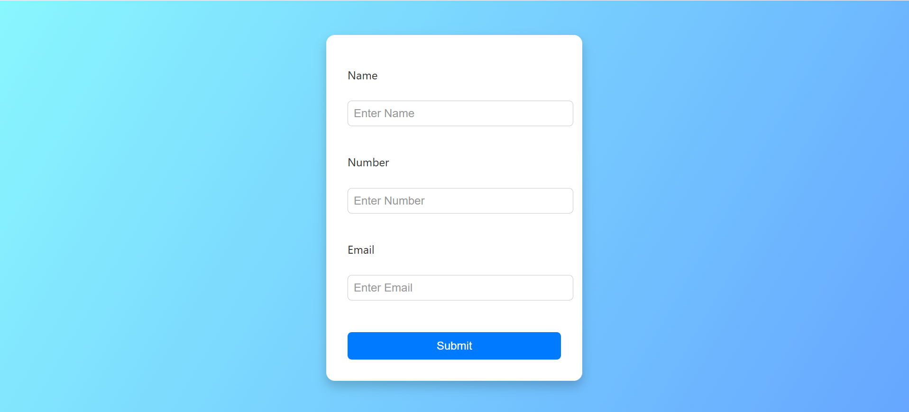

# Login-Page
Simple login page using HTML, CSS &amp; JavaScript

# 🌟 Stylish Contact Form UI

A sleek and modern contact form designed with HTML & CSS. This responsive form features a beautiful gradient background, soft shadows, and a clean input structure — ideal for landing pages, portfolios, or registration sections.

---

## 📸 Screenshot



---

## 🚀 Features

- ✨ Minimal & elegant design
- 🎨 Gradient background for aesthetic appeal
- 🔒 Input fields for Name, Number, and Email
- ✅ Responsive layout
- 📱 Mobile-friendly

---

## 🛠️ Tech Stack

- **HTML5** – Markup structure  
- **CSS3** – Styling and layout  

---

## 📦 How To Use (for Local Preview)

```bash
1. Clone the repository:
   git clone https://github.com/vinaya2007/Login-Page.git

2. Navigate to the project folder:
   cd Login-Page

3. Open `index.html` in your browser.
```

## 📬 Contact
📧 vinayavinodh07@gmail.com
📞 +91 90032 80933

## Credits

Built by Vinaya V
